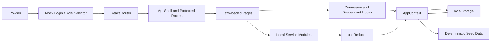

# MoveInSync Vendor Hub

MoveInSync Vendor Hub is a browser-based vendor, fleet, driver, document, and delegation management demo for a four-level vendor hierarchy.

The application models scoped access across Super, Regional, City, and Local vendors. It ships as a Vite single-page React application with deterministic seed data and debounced `localStorage` persistence. There is currently no server, database, external API, or real authentication provider.

## Overview

The project demonstrates how a transport operations platform can provide a shared operational view while keeping data and actions scoped to the currently selected vendor. Users select a vendor role from the mock login screen, then work within a responsive Material UI shell.

The main workflow is:

1. Select a seeded vendor from the mock login screen.
2. Review role-scoped dashboard KPIs, document alerts, and recent activity.
3. Navigate to the areas permitted for that vendor.
4. Create and manage vendors, vehicles, drivers, and documents where the current role allows writes.
5. Grant or revoke delegated permissions for descendant vendors.
6. Switch vendor context to verify hierarchy scope, disabled-parent write blocking, and delegation resolution.

## Features

- Four-level vendor hierarchy: `super`, `regional`, `city`, and `local`.
- Role switching through the login screen and top-bar vendor selector.
- Vendor tree, search, pagination, detail views, status changes, and parent-level validation.
- Vehicle onboarding, duplicate-registration validation, searchable/sortable fleet table, disable-with-reason, and maintenance state.
- Driver onboarding and validation, driver detail pages, and vehicle assignment or unassignment.
- Document upload, verification/rejection actions, document type/status/vendor filters, and expiry classification.
- Dashboard KPIs for vehicles, drivers, expiring/expired documents, and pending verifications.
- Delegation grant, revoke, inbound, outbound, and history views.
- Client-side permission gates and protected routes with vendor-descendant scoping.
- Narrowest-ancestor delegation resolution, including revoked-delegation denial.
- Disabled or suspended ancestor detection that blocks descendant writes in the UI.
- Audit log entries for reducer mutations, capped at 200 entries.
- Toast notifications through Notistack.
- Lazy-loaded routes with a Suspense skeleton and a global error boundary.
- Responsive navigation using Material UI's permanent desktop drawer and temporary mobile drawer.
- Cross-tab state synchronization through the browser `storage` event.

## Tech Stack

### Frontend

- React 19
- Vite 8
- JavaScript with JSX
- Material UI 9 and Emotion
- React Router DOM 7
- Inter and JetBrains Mono via `@fontsource`

### State and persistence

- React Context and `useReducer`
- Browser `localStorage`
- Versioned storage key: `mis:vendor-mgmt:v1`
- Debounced writes and a custom storage-quota event

### Authentication and authorization

- Mock login implemented by selecting a vendor role
- Client-side route protection with `ProtectedRoute`
- Client-side inline authorization with `PermissionGate` and `usePermission`
- Hierarchy and delegation rules in `src/services/rbac.service.js`

### Testing and developer tools

- Vitest 5
- Testing Library for React, DOM assertions, and user events
- JSDOM
- OxLint
- Prettier

### Deployment

- Vercel SPA rewrite in `vercel.json`
- Netlify build and SPA fallback configuration in `netlify.toml`
- Vite production chunking for React, MUI/Emotion, and application code

### APIs, services, and database

There are no HTTP API routes, external service integrations, backend services, or database drivers in the current repository. The modules in `src/services/` are local business-logic services that read state passed from React and return records or reducer actions.

## System Architecture



### Runtime data flow

1. `AppProvider` asynchronously reads the versioned state from `localStorage`.
2. If no compatible state exists, `getSeedState()` creates the vendor hierarchy and operational records.
3. Pages read state through `useApp()` and derive vendor scope with `useVendorDescendants()`.
4. Service modules validate input and return reducer actions or computed results.
5. `appReducer` applies mutations and records an audit entry for state-changing actions.
6. `AppContext` saves the updated state with a 300 ms debounce.

## Application Routes

| Path | Page | Access rule |
| --- | --- | --- |
| `/login` | Mock login | Public entry point |
| `/` | Dashboard | Requires a selected vendor |
| `/vendors` | Vendor hierarchy and list | `vendors.read` |
| `/vendors/:id` | Vendor details and tabs | `vendors.read` |
| `/fleet` | Fleet management | `fleet.read` |
| `/drivers` | Driver management | `drivers.read` |
| `/drivers/:id` | Driver details | `drivers.read` |
| `/documents` | Document center | `documents.read` |
| `/delegations` | Delegation management | `delegations.manage` |
| `/reports` | Reports placeholder | `reports.read` |
| `/settings` | Settings placeholder | Requires a selected vendor |
| `/403` | Unauthorized page | Internal fallback |
| `*` | Not-found page | Internal fallback |

## Authorization Model

Authorization is evaluated in the browser by `can(action, targetVendorId, currentVendorId, state)`.

- Super and Regional vendors receive broad baseline access over their own scope and descendants.
- City vendors can read vendors, manage fleet and drivers, read/upload documents, and read reports within scope.
- Local vendors can manage fleet and drivers, read/upload documents, and read reports within scope.
- The current vendor can target itself or descendants; unrelated branches are outside scope.
- Route-level permissions hide unauthorized navigation and redirect denied routes to `/403`.
- `PermissionGate` hides or replaces unauthorized action controls.

### Delegation conflict rule

Delegated permissions are resolved from the current vendor upward through its ancestor chain. The first matching delegation for a permission decides the result. A revoked matching delegation denies access and prevents broader ancestor grants from being consulted.

The seed data includes a demonstration where a broad `payments` grant is overridden by a closer revoked delegation.

### Disabled-parent rule

Disabling a vendor does not mutate its descendants or their records. Instead, `isAnyAncestorDisabled()` detects disabled or suspended ancestors and the UI displays a parent-disabled banner while write controls are blocked. The existing cascade helper accepts an override flag for higher-privilege flows.

## Domain Data

The initial state contains:

- 18 vendors: one Super, three Regional, six City, and eight Local vendors.
- Five seeded delegations covering active, revoked, and delegated permission examples.
- 120 vehicles distributed across Local vendors.
- 120 drivers, initially assigned one-to-one to the seeded vehicles.
- 360 documents: a DL, RC, and INSURANCE record for each seeded driver.
- An initially empty audit log.

The main state shape is:

```text
{
  schemaVersion,
  currentVendorId,
  vendors[],
  delegations[],
  vehicles[],
  drivers[],
  documents[],
  auditLog[]
}
```

Document expiry is classified as `valid`, `expiring_soon` (30 days or less), or `expired`. Uploading, verifying, or rejecting documents can also flag an associated vehicle for `pending_verification` when mandatory documents are expired.

## Project Structure

```text
moveinsync/
├── index.html                 # Vite HTML entry point
├── package.json               # Scripts and dependencies
├── vite.config.js             # Vite, aliases, chunks, and Vitest setup
├── vercel.json                # Vercel SPA rewrite
├── netlify.toml               # Netlify build and SPA fallback
├── public/                    # Logo and favicon assets
├── plan/                      # Historical implementation planning notes
└── src/
    ├── App.jsx                # Router, Suspense, and error boundary
    ├── main.jsx               # React providers and application bootstrap
    ├── components/            # Common, vendor, vehicle, driver, document, RBAC UI
    ├── data/seed.js           # Deterministic initial state generator
    ├── hooks/                 # Permission and hierarchy hooks
    ├── layouts/               # AppShell and TopBar
    ├── pages/                 # Route-level screens
    ├── routes/                # Route definitions and guards
    ├── services/              # Local domain logic, reporting, RBAC, and storage
    ├── state/                 # Context and reducer
    ├── theme/                 # Material UI theme
    └── utils/                 # Validation, constants, and hierarchy helpers
```

## Getting Started

### Requirements

- Node.js 18 or newer
- npm 9 or newer

### Install

```bash
git clone https://github.com/jhanvi-11/moveinsync.git
cd moveinsync
npm install
```

### Run locally

```bash
npm run dev
```

Vite serves the application at `http://localhost:5173` by default.

### Reset demo data

The app persists state in the browser. To return to the deterministic seed, remove the `mis:vendor-mgmt:v1` entry from browser storage for the site, then reload the application.

## Scripts

| Command | Purpose |
| --- | --- |
| `npm run dev` | Start the Vite development server |
| `npm run build` | Create the production bundle in `dist/` |
| `npm run preview` | Preview the built bundle locally |
| `npm run test` | Run Vitest once |
| `npm run lint` | Run OxLint |

## Testing

Tests are colocated with the implementation and cover service logic, hierarchy behavior, route protection, common components, and selected page workflows. Vitest uses a JSDOM environment and loads `src/setupTests.js` for Testing Library matchers.

Run the suite with:

```bash
npm run test
```

For a production-like check, run:

```bash
npm run lint
npm run build
```

## Deployment

### Vercel

The repository includes `vercel.json` with a catch-all rewrite to `/index.html`, which keeps BrowserRouter routes working after a direct navigation. Deploy the Vite output using the repository's build command:

```bash
npm run build
```

The configured Vercel demo URL referenced by the project is [moveinsync.vercel.app](https://moveinsync.vercel.app).

### Netlify

`netlify.toml` publishes `dist/`, runs `npm run build`, and applies the same SPA fallback rewrite.

## Security Considerations

- This is a client-only demo. RBAC, route protection, and data are all observable and mutable in the browser.
- The mock login is not identity verification and must not be used as production authentication.
- `localStorage` is not an appropriate store for sensitive personal, driver, or compliance data in production.
- There is no server-side authorization, tenant isolation, API validation, database access control, secret management, or audit-log tamper protection.
- A production implementation should move authorization and persistence to a trusted backend, authenticate users with an identity provider, validate every request server-side, and protect sensitive documents and personal data.

## Current Limitations

- Reports and Settings are placeholder pages in the current implementation.
- There is no backend API or database; the service layer is intentionally local and is not a network abstraction.
- The delegation `scope` value is stored, but the current RBAC resolver does not apply scope variants separately.
- The document center's seeded-record filter expects `vendorId`, while seeded documents are associated through `uploadedByVendorId` and their driver relationship; this area may require alignment before production use.
- Vendor creation currently dispatches `ADD_VENDOR`, while the reducer defines `CREATE_VENDOR`; the create flow should be reconciled before relying on it.
- The current repository snapshot has a build-time import mismatch: `DriversPage.jsx` imports a default `useVendorDescendants` export while the hook currently exposes a named export.
- The application has no environment variables or secrets. No `.env` file is required for the current demo.

## License

MIT
